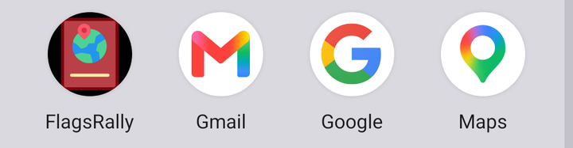
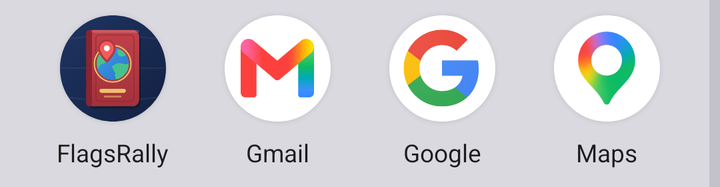
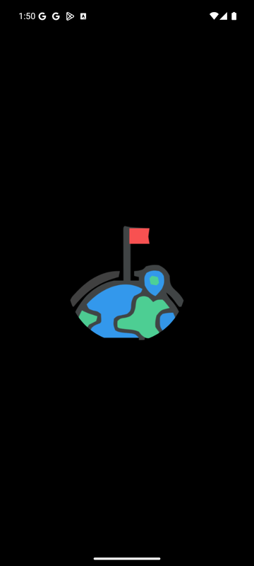

# FlagsRallyデザイン提案（2026-10-08）

モックアップ付きの版は[flagsrally-redesign.html](flagsrally-redesign.html)にあります。この文書は提案のみで、コードは変更していません。

## 1. 現状の課題

| 観察したこと | なぜ問題か | 対応 |
|---|---|---|
| ステータスバー・ボタン・タブがMAUIテンプレートの紫`#512BD4` | アプリ固有の印象が残らない | パスポートの紺とスタンプの赤を軸にした配色トークンに置き換える |
| 画面ごとに見た目の言語が違う（スタンプ風／クリーム色のタイル／標準フォーム／地図） | 同じアプリに見えない | 紙・インク・スタンプの素材で統一する |
| 色の直書き（AntiqueWhite / Red / DodgerBlue / `#1E50A2`） | ダークモードで破綻し、一括変更できない | `Colors.xaml`のトークン経由にする |
| 「ボード」タブに国旗ボードとカスタムボードが同居し、カスタムボードは0件だと消える | 場所が予測できない | 「コレクション」タブに統合する |
| インポートが地図画面の「＋」の文字 | 見つけられない | コレクション画面の「ボードを追加」カードへ移す |
| 削除・リセットが情報ウィンドウの長押し | 見えない操作 | ピン詳細シートにボタンで並べる |
| 画面上部の説明文 | UIが自己説明できていない | 主ボタンのラベルと状態で伝える |
| フォント4種の役割が未定義（Open Sansは日本語なし） | 強弱に一貫性がない | UI／タイル見出し／スタンプの3役に整理 |
| 設定画面の右寄せ紫ボタンと赤字 | 優先度がわからない | リスト形式にし、危険な操作だけ色を変える |
| Android標準の下線付きPicker | 未完成に見える | 枠付きセレクターかチップにする |

## 2. 方向性「旅券と入国スタンプ」

画面の地は紙、構造は表紙の紺、達成の瞬間はスタンプの赤。赤は記録・チェックインだけに使う。

| トークン | 値 | 用途 |
|---|---|---|
| Passport Navy | `#1F3A68` | 主要色（アプリバー、選択状態） |
| Stamp Red | `#C8402F` | 行動（チェックイン、記録、訪問済み） |
| Crest Gold | `#B58A2E` | 実績・初訪問の演出のみ |
| Visa Paper | `#FBF8F1` | 画面の地（AntiqueWhiteの置き換え） |
| Ink | `#1B2233` | 本文・枠線 |
| Success | `#2F7D5B` | 状態表示のみ |

- **文字**：UIはNoto Sans JP、タイル見出しはKiwi Maru、スタンプはJerseyclub Grunge（欧文）とcraftmincho（和文）を続投。Open SansはUIから外す。
- **形**：余白は4/8/12/16/24、角丸はコントロール10・シートとカード16、影はシートと浮いたボタンのみ、タップ領域は最低44pt。

## 3. 情報設計

| 現在 | 提案 |
|---|---|
| Banner：パスポート画像と到着スタンプ | **パスポート**：表紙、訪問国・地域・チェックイン数、最近のスタンプ |
| Boards：国旗ボード／カスタムボード（上タブ、0件で非表示） | **コレクション**：国・地域・カスタムボードを進捗付きカードで。追加・並べ替え・削除もここ |
| Location：地図、フィルター、インポート、記録／チェックイン | **マップ**：フィルターチップ、「ここを記録」、ピン詳細シート |
| Settings | **設定**：リスト形式（購読、データ、詳細設定） |

## 4. 画面案（HTML版にモックアップ）

- **マップ**：重なったピンに件数を表示し、シート内で選ぶ。チェックイン・経路・削除はボタン。
- **コレクション**：国旗ボードとカスタムボードを同じカードで並べる。「編集」でボード管理画面へ。
- **ボード詳細**：進捗を先頭に、訪問済／未訪問の切り替え。未訪問の枠はマップのその地点へ移動。
- **パスポート**：統計の要約と最近のスタンプ。

## 5. アイコンとスプラッシュ

今のモチーフ（アイコン：赤いパスポート・地球・ピン・金の帯／スプラッシュ：旗を立てた地球・ピン・弧）と構図・色の組み合わせは変えず、描き方を整える。素材は`docs/design/assets/`にある。

| 項目 | 現在 | 提案 |
|---|---|---|
| 線と形 | ビットマップのトレース。輪郭が波打ち、小さいと潰れる | 図形で描き直し、線幅と角丸を統一 |
| 背景 | 黒。アイコンは黒い四角が残る | 深い紺のグラデーションとかすかな緯線。アイコンとスプラッシュで共通 |
| 輪郭線 | スプラッシュは太いグレーの縁取り | 縁取りをやめ、面の色とハイライトで形を見せる |
| 色 | 原色に近く、2つの画像で少しずつ違う | 同じ色相で彩度をそろえる（赤`#C2414A`、海`#3E9BEA`→`#2878C9`、陸`#46C38C`、金`#E9C46A`） |
| 奥行き | パスポートが平面 | 背表紙、型押しの枠、上辺の光、落ち影 |
| 要素の重なり | ピンが地球に埋もれる | ピンを表紙の色で縁取って分離 |
| 弧 | 太いグレーの線 | 金の点線（旅のルート） |
| 切り抜きへの対応 | 考慮なし | アイコンは半径33、スプラッシュは半径36の円に収める |

| 現在 | 提案 |
|---|---|
|  |  |
|  |  |

上の画像は、提案のSVGを一時的にアプリへ組み込んでエミュレーター（Pixel 7 / Android 16）で撮影したもの。確認後、アプリの素材は元に戻している。iOSは未確認。

組み込み方：

```text
docs/design/assets/icon-background.svg → Resources/AppIcon/appicon.svg
docs/design/assets/icon-foreground.svg → Resources/AppIcon/appiconfg.svg
docs/design/assets/splash.svg          → Resources/Splash/splash.svg
```

```xml
<!-- FlagsRally.csproj：プラットフォーム別の4行を1行にまとめる -->
<MauiIcon Include="Resources\AppIcon\appicon.svg"
          ForegroundFile="Resources\AppIcon\appiconfg.svg"
          Color="#14254A" ForegroundScale="1.0" />
<MauiSplashScreen Include="Resources\Splash\splash.svg"
                  Color="#14254A" BaseSize="128,128" />
```

- スプラッシュの後に一瞬出るアプリ本体の背景（今はテンプレートの紫）も、`Platforms/Android/Resources/values/colors.xml`の`colorPrimary`を紺にそろえる
- Android 12以降のスプラッシュはOSが拡大するため少し柔らかく見える。気になる場合は`BaseSize`を大きくして比べる
- ストア用512pxアイコンも同じ2枚のSVGから書き出す。Android 13のテーマアイコンには単色版を追加する

## 6. 使いやすさの改善

- カスタムボード0件でもタブを消さず、空の状態で追加方法を示す
- 主ボタンは画面ごとに1つ
- 長押し操作は必ずボタンでも用意する
- チェックイン時のスタンプ演出と振動、初訪問だけ金色
- 「近くにいません」に残り距離と経路ボタンを添える
- 削除後は「元に戻す」付きトーストで確認ダイアログを減らす
- 読み込み中はスケルトン表示

## 7. 導入ステップ

1. **見た目の土台**：配色・フォントのトークン化、直書き色の除去、ダークモード対応、アイコンとスプラッシュの差し替え（`Colors.xaml`、`Styles.xaml`、`Platforms/Android/Resources/values/colors.xml`、各XAML、`Resources/AppIcon/*.svg`、`Resources/Splash/splash.svg`、`FlagsRally.csproj`）
2. **マップの操作**：ピン詳細ボトムシート、フィルターチップ、「ここを記録」ボタン（`LocationPage.xaml`、`LocationPageViewModel.cs`）
3. **タブの再編**：コレクションタブ新設、インポートの移動（`AppShell.xaml`、新規`CollectionsPage.xaml`）
4. **仕上げ**：パスポート画面の統計、演出、空の状態、トースト、設定画面のリスト化

## 8. 決めていただきたいこと

1. 配色の方向性（紺・赤・紙）でよいか。別案として緑系や御朱印帳寄りの和紙・朱色系も可能
2. ボトムシートにライブラリ（例：The49.Maui.BottomSheet）を使うか、自前で作るか
3. タブ再編（段階3）まで進めるか、段階1・2を先に出すか
4. アイコンとスプラッシュの背景を紺にするか、今の黒を残すか（紺にする場合はアプリ本体の背景色も合わせる）
5. スタンプ用フォント（Jerseyclub Grunge、craftmincho）を続投するか（ライセンス確認）
